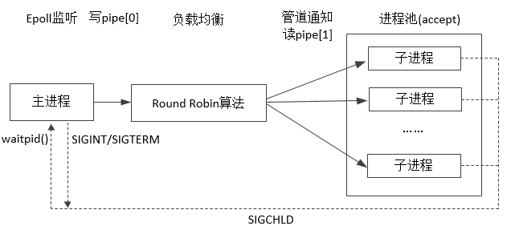

# tinyserver
## 使用进程池+epoll方式实现的简单http服务器。父程序创建进程池，并监听客户端连接。父进程与子进程池之间利用管道进行通信，父进程将连接请求通知子进程处理（采用轮询方式选择），子进程完成客户端http请求处理过程。父子进程在接收到注册信号后调用信号处理函数进行处理。信号处理函数仅通知当前信号事件，逻辑处理交由用户态代码完成，避免信号处理时间过长（如果采用signal信号处理方式还可能导致信号丢失）。
## 实现模型图：

### cgi程序修改自J.David源码，以验证服务端逻辑功能。后续考虑抽象“子进程选择”功能，采用其他负载均衡策略测试。由于cgi会使用标准输入输出接口，故守护进程功能（daemon_init）未进行部署。
### 部署方法
### make
### ./tinyserver
### 在浏览器输入：127.0.0.1:8001
### 如果POST命令不能正常显示返回结果，将htdocs目录下的cgi文件设置为可执行权限
### 最后。JUST FOR FUN
Copyright by Malt（chenjiaxin2604@qq.com）